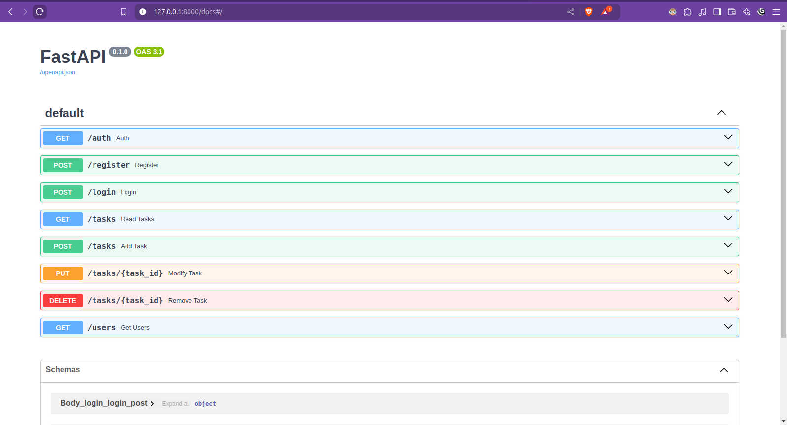

## Overview

Ergasium is a task management application built with FastAPI. It provides a simple and efficient way to manage tasks with functionalities such as user registration, authentication, and CRUD operations for tasks. This application uses SQLite for data storage, and Passlib for password hashing and verification.

## Features

- User Registration and Authentication
- Task Creation, Reading, Updating, and Deleting (CRUD)
- JWT-based User Authentication
- Simple In-memory Storage for Testing

## Technologies Used

- **Python**: Programming language
- **FastAPI**: Web framework for building APIs
- **SQLite**: Database for data storage
- **SQLAlchemy**: ORM for database operations
- **Passlib**: Library for password hashing
- **JWT**: JSON Web Tokens for authentication
- **Uvicorn**: ASGI server for running FastAPI

## Setup

### Prerequisites

- Python 3.9+
- Virtual environment tool (recommended: `venv` or `virtualenv`)

### Installation

1. **Clone the repository**:
   ```sh
   git clone https://github.com/straystringz/ergasium.git
   cd ergasium
   ```

2. **Create and activate a virtual environment**:
   ```sh
   python -m venv .env
   source .env/bin/activate
   ```

3. **Install the required packages**:
   ```sh
   pip install -r requirements.txt
   ```

4. **Run the server**:
   ```sh
   uvicorn app.main:app --reload
   ```

## Usage

### API Endpoints

#### User Registration

- **URL**: `/register`
- **Method**: `POST`
- **Payload**:
  ```json
  {
    "username": "testuser",
    "email": "test@example.com",
    "password": "testpassword"
  }
  ```

#### User Login

- **URL**: `/login`
- **Method**: `POST`
- **Payload**:
  ```json
  {
    "username": "testuser",
    "password": "testpassword"
  }
  ```

#### Create Task

- **URL**: `/tasks`
- **Method**: `POST`
- **Headers**: `Authorization: Bearer <access_token>`
- **Payload**:
  ```json
  {
    "title": "New Task",
    "description": "Task Description",
    "due_date": "2025-01-01",
    "priority": 1,
    "completed": false
  }
  ```

#### Read Tasks

- **URL**: `/tasks`
- **Method**: `GET`
- **Headers**: `Authorization: Bearer <access_token>`

#### Update Task

- **URL**: `/tasks/{task_id}`
- **Method**: `PUT`
- **Headers**: `Authorization: Bearer <access_token>`
- **Payload**:
  ```json
  {
    "title": "Updated Task",
    "description": "Updated Description",
    "due_date": "2025-01-01",
    "priority": 1,
    "completed": true
  }
  ```

#### Delete Task

- **URL**: `/tasks/{task_id}`
- **Method**: `DELETE`
- **Headers**: `Authorization: Bearer <access_token>`



## Running Tests

1. **Activate the virtual environment** (if not already activated):
   ```sh
   source .env/bin/activate
   ```

2. **Run the tests**:
   ```sh
   python -m pytest
   ```

## Contributing

Contributions are welcome! Please open an issue or submit a pull request for any improvements or bug fixes.

## License

This project is licensed under the MIT License. See the [LICENSE](LICENSE) file for details.

## Contact

- **Author**: Victor Emmanuel
- **Email**: hire.victor@outlook.com
- **GitHub**: [DevChoco](https://github.com/straystringz)
